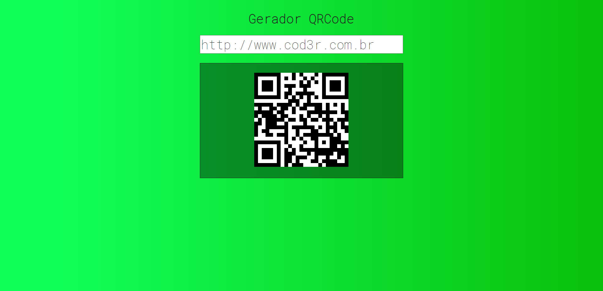

<h3 align="center">Gerador de QRCode usando VueJS</h3>
<h4>https://luca-merighi.github.io/QRCode-WebModerno/</h4>
<h4 align="center">Projeto do Curso Web Moderno Completo com JavaScript Da @Cod3r</h4>

